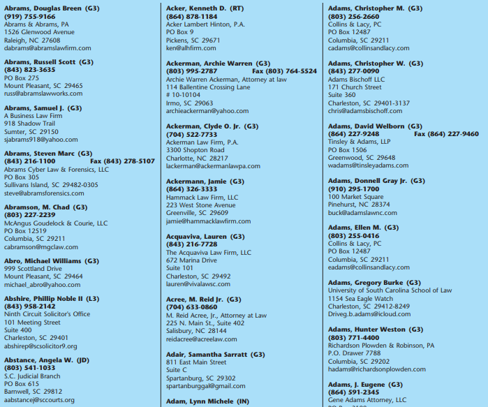
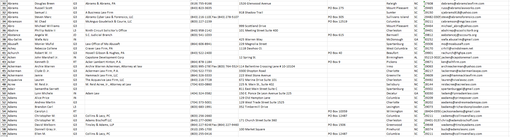

# PDF-scraper
Freelance work based on scrape ~500 pages PDF and get all the avalaible data organized in a Excel spreadsheet.
I have to use Regular Expresions and pandas library.
The data consist in full names, status, company, phone number, fax, address, city, zip code and emails of ~18000 people.

The PDF looks like: 

And the result in a Excel spreadsheet: 

